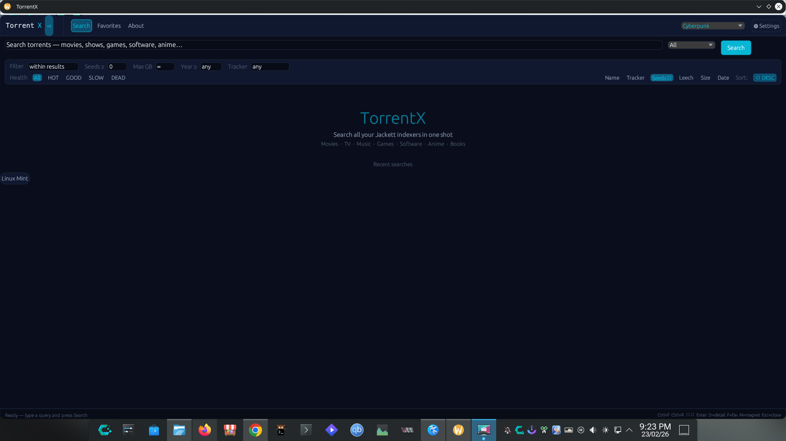
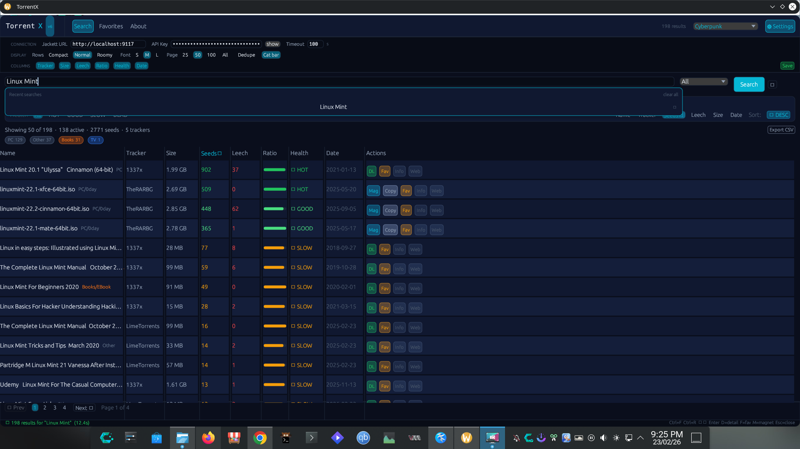

<div align="center">

```
████████╗ ██████╗ ██████╗ ██████╗ ███████╗███╗   ██╗████████╗██╗  ██╗
╚══██╔══╝██╔═══██╗██╔══██╗██╔══██╗██╔════╝████╗  ██║╚══██╔══╝╚██╗██╔╝
   ██║   ██║   ██║██████╔╝██████╔╝█████╗  ██╔██╗ ██║   ██║    ╚███╔╝ 
   ██║   ██║   ██║██╔══██╗██╔══██╗██╔══╝  ██║╚██╗██║   ██║    ██╔██╗ 
   ██║   ╚██████╔╝██║  ██║██║  ██║███████╗██║ ╚████║   ██║   ██╔╝ ██╗
   ╚═╝    ╚═════╝ ╚═╝  ╚═╝╚═╝  ╚═╝╚══════╝╚═╝  ╚═══╝   ╚═╝   ╚═╝  ╚═╝
```

**Native Rust · egui · Jackett-powered**

[](https://www.rust-lang.org/)
[](LICENSE)
[]()
[](https://github.com/emilk/egui)

*A blazing-fast, native torrent search interface — no Electron, no browser, no bloat.*

</div>

---

## What is TorrentX?

TorrentX is a native desktop GUI that connects to your local [Jackett](https://github.com/Jackett/Jackett) instance and searches all your configured indexers simultaneously. It compiles to a **single ~11 MB binary** with no runtime dependencies, starts instantly, and stays out of your way.

---

## Features

| Category | Details |
|----------|---------|
| **Search** | All Jackett indexers at once · Deduplication across trackers · Category filter · Search history with per-item delete |
| **Results** | Sort by Seeders / Size / Date · Filter by text, seeds, size, year, tracker, health · Pagination (25 / 50 / 100 / All) |
| **Actions** | Open magnet · Copy magnet · Download `.torrent` · Save to Favorites · Open details in browser |
| **UI** | 19 themes (16 dark, 3 light) · Adjustable row density · Adjustable font size · Detail side panel with ratio bar |
| **Extras** | Favorites with search & timestamps · Export to CSV · Animated search spinner · Keyboard navigation |

### Keyboard Shortcuts

| Key | Action |
|-----|--------|
| `↑` / `↓` | Navigate rows |
| `Enter` / `M` | Open magnet for selected row |
| `D` | Toggle detail panel |
| `F` | Add selected to Favorites |
| `Esc` | Clear search input |
| `Ctrl+F` | Focus search bar |
| `Ctrl+R` | Re-run last search |

---

## Screenshots





> 🎬 **[Watch demo video](assets/Screencast_20260223_212551.webm)**

---

## Download

Pre-built binaries are on the [**Releases**](https://github.com/chethan62/torrentx/releases) page.

| Platform | Format | Run |
|----------|--------|-----|
| Linux | `.AppImage` | `chmod +x TorrentX-*.AppImage && ./TorrentX-*.AppImage` |
| Linux | plain binary | `./torrentx` |
| Windows | `.exe` | Double-click or run from terminal |
| macOS | `.dmg` / `.app` | *(coming soon)* |

---

## Build from Source

### Requirements

- [Rust](https://rustup.rs/) (stable)
- Jackett running locally

### Install Rust

```bash
curl --proto '=https' --tlsv1.2 -sSf https://sh.rustup.rs | sh
source $HOME/.cargo/env
```

### System Dependencies

<details>
<summary><b>Arch Linux</b></summary>

```bash
sudo pacman -S base-devel pkg-config openssl gtk3
```
</details>

<details>
<summary><b>Ubuntu / Debian</b></summary>

```bash
sudo apt install build-essential pkg-config libssl-dev libgtk-3-dev
```
</details>

<details>
<summary><b>Fedora</b></summary>

```bash
sudo dnf install gcc pkg-config openssl-devel gtk3-devel
```
</details>

<details>
<summary><b>Windows</b></summary>

Install [Rust for Windows](https://static.rust-lang.org/rustup/dist/x86_64-pc-windows-msvc/rustup-init.exe) — Visual Studio C++ build tools are required ([setup guide](https://rust-lang.github.io/rustup/installation/windows-msvc.html)).
</details>

### Build & Run

```bash
git clone https://github.com/chethan62/torrentx
cd torrentx

# Development build
cargo run

# Optimized release build (~11 MB binary)
cargo build --release

# Run
./target/release/torrentx          # Linux / macOS
.\target\release\torrentx.exe      # Windows
```

> First build downloads and compiles dependencies — expect 2–4 minutes. Subsequent builds are fast.

---

## Usage

1. **Start Jackett** — [http://localhost:9117](http://localhost:9117)

2. **Open TorrentX** — a native window appears immediately.

3. **Configure** — click the ⚙ Settings bar, paste your Jackett API key, adjust columns and timeout. Settings are saved automatically.

4. **Search** — type a query, pick a category, hit `Enter`. Results populate a sortable, filterable table.

5. **Act on results** — select a row and use keyboard shortcuts or the inline action buttons (`Mag` · `Copy` · `DL` · `Fav` · `Info` · `Web`).

---

## Themes

19 built-in themes — switch instantly, no restart needed.

**Dark:** Tokyo Night · Cyberpunk · Midnight · One Dark · Catppuccin Mocha · Dracula · Rose Pine · Monokai · Kanagawa · Everforest · Material Ocean · Oxocarbon · Ayu · Nord · Gruvbox · Solarized Dark

**Light:** Light · Gruvbox Light · Catppuccin Latte

---

## Tech Stack

| | |
|---|---|
| Language | Rust 2021 |
| GUI | [egui](https://github.com/emilk/egui) 0.27 + egui_extras |
| Rendering | GPU via wgpu / OpenGL (eframe) |
| HTTP | [reqwest](https://github.com/seanmonstar/reqwest) (blocking) |
| Config | `~/.config/torrentx/config.json` |

---

## Acknowledgements

Built with the assistance of [Claude AI](https://claude.ai) and [DeepSeek AI](https://deepseek.com).

Thanks to the open-source projects that made this possible: **egui**, **reqwest**, and **Jackett**.

---

## License

[MIT](LICENSE) — use freely, credit appreciated.

---

## Contributing

Issues and pull requests are welcome on [GitHub](https://github.com/chethan62/torrentx).
