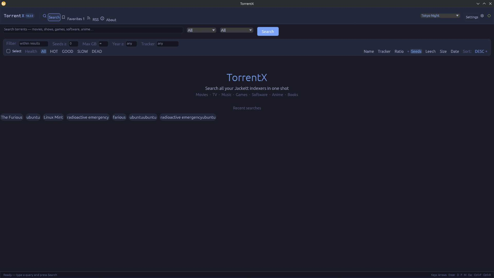
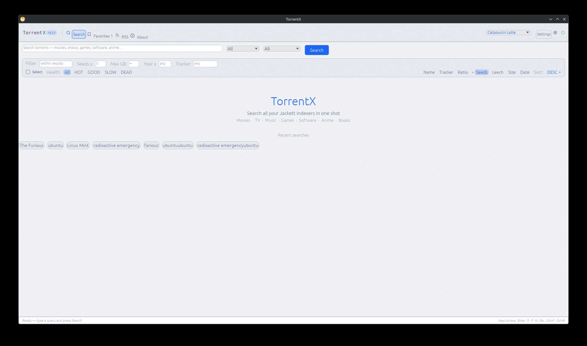

# TorrentX

**Native Rust desktop torrent search app** — query all your [Jackett](https://github.com/Jackett/Jackett) indexers from one blazing-fast GUI.

[](https://github.com/chethan62/torrentx/releases/latest)
[](LICENSE)
[](GUIDE.md)

## Screenshots

| Dark (Tokyo Night) | Light (Catppuccin Latte) |
|--------------------|--------------------------|
|  |  |

*19 themes total — 16 dark + 3 light, instant switching.*

## Features

- **19 themes** — 16 dark + 3 light, instant switching
- **All Jackett indexers** — search 100+ trackers simultaneously, or pick one
- **Multi-column results** — Name, Tracker, Size, Seeds, Leechers, Ratio, Health, Date (toggle any, reorder via Settings)
- **Row density** — Compact / Normal / Roomy
- **Filters** — text search, min seeds, size range, year, tracker, health status, category chips
- **Sort** — by Name, Tracker, Size, Seeds, Leechers, Ratio, Date
- **Favorites** — save torrents with timestamps, search filter, persistent storage
- **Detail panel** — seeder/leecher ratio bar, magnet copy/open, .torrent download
- **Batch actions** — select mode, select-all, copy N magnets at once
- **Keyboard shortcuts** — ↑↓ Enter D F M Ctrl+F Ctrl+R Esc
- **CSV export** — export filtered results
- **Pagination** — 25/50/100/All
- **Deduplication** — across trackers (main search + RSS)
- **Search history** — with per-item delete
- **RSS feeds** — Jackett Torznab indexer feeds with auto-refresh (10 min), deduped
- **Custom accent color** — override any theme's accent
- **System tray** — minimize-to-tray with Show/Hide + Quit
- **Desktop notifications** — alerted when a search completes
- **`--config <path>`** — portable config for multiple profiles/installs
- **Update checker** — notifies when a new release is out (opt-out in Settings)
- **Toast notifications** — animated, per-theme colored
- **egui 0.36** — modern rendering, GPU-accelerated

## Download

Grab the latest build from the [releases page](https://github.com/chethan62/torrentx/releases/latest):

| Platform | File | Size |
|----------|------|------|
| Linux (AppImage) | `TorrentX-<version>-x86_64.AppImage` | ~9 MB |
| Linux (binary) | `torrentx` | ~20 MB (stripped, LTO) |

## Build from source

```bash
# Prerequisites: Rust 1.82+, cargo
cargo build --release
# Binary: target/release/torrentx
```

## Setup

1. Launch TorrentX
2. Click ⚙ **Settings**
3. Enter your Jackett URL (default: `http://localhost:9117`) and API Key
4. Start searching

📖 **Full documentation**: [GUIDE.md](GUIDE.md) — installation, filters,
RSS, settings reference, config file, troubleshooting, and privacy notes.

## Tech

- **GUI:** egui 0.36 + eframe (GPU-accelerated via wgpu, software-GL fallback)
- **HTTP:** reqwest (blocking)
- **Config:** `~/.config/torrentx/config.json`
- **Binary size:** ~20 MB stripped + LTO; ~9 MB packed as AppImage

## License

MIT © [chethan62](https://github.com/chethan62)
